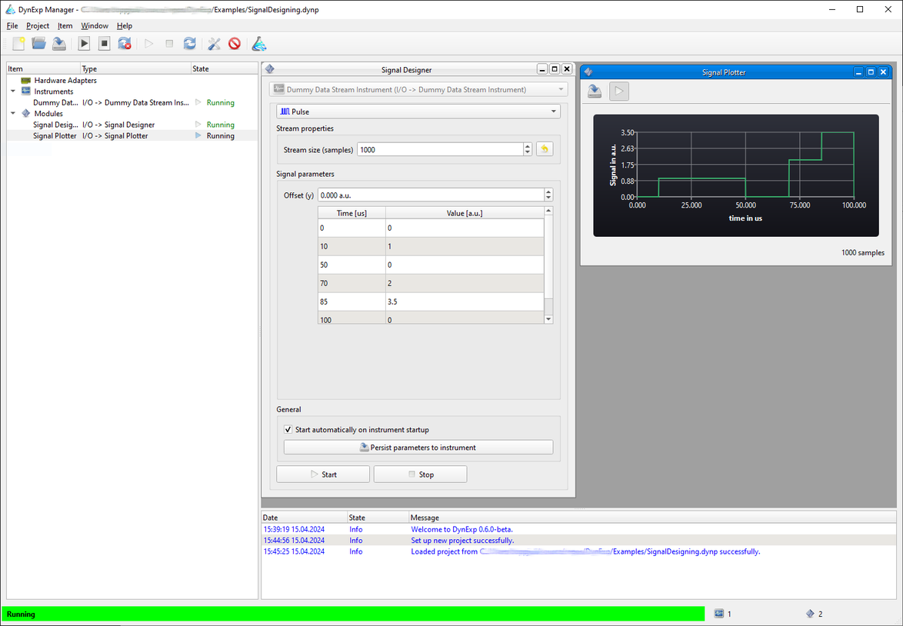
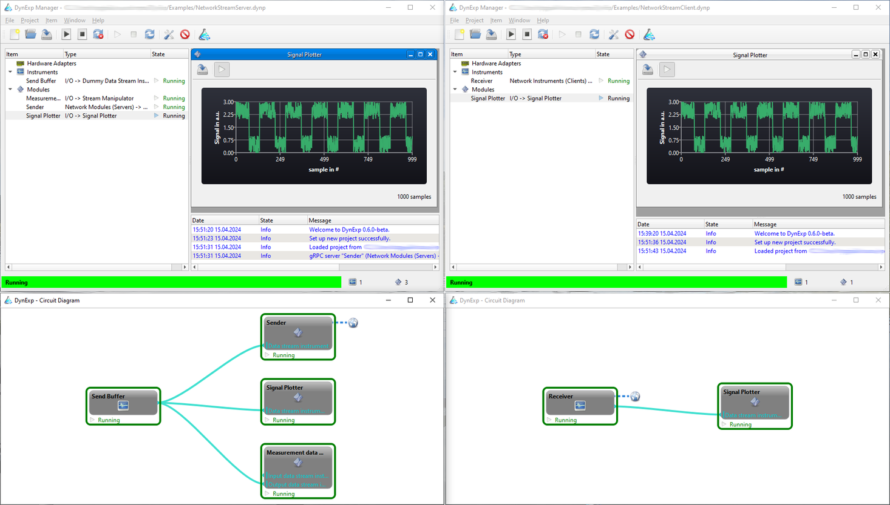
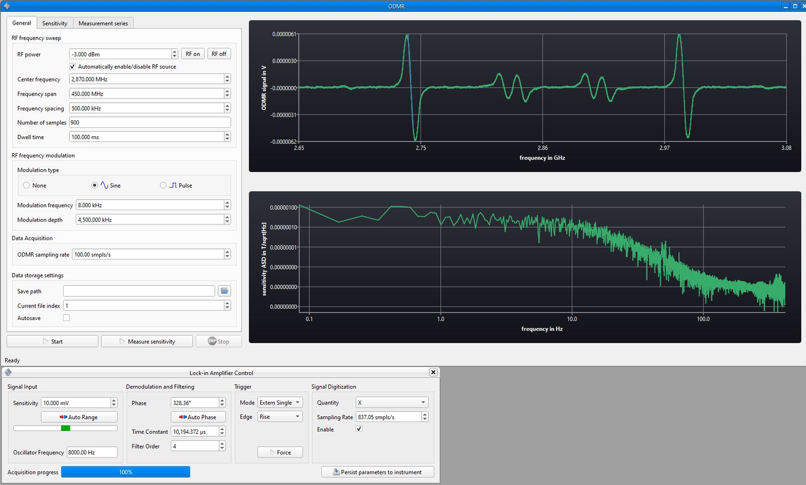
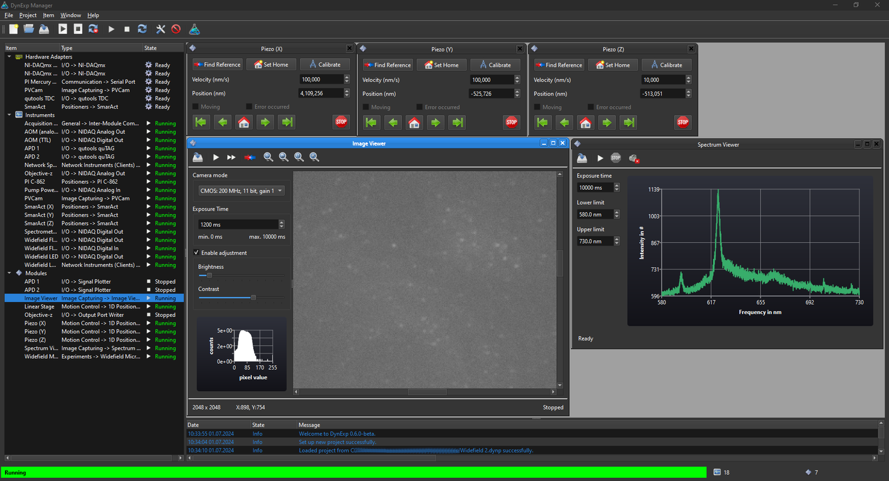

# DynExp Readme

**DynExp** is an open-source tool for highly flexible laboratory automation for dynamically changing experiments based on modern C++.

Its idea is rather simple: DynExp implements hardware and devices typically employed in (physics) labs.
It provides access to abstract and generalized instruments, which can use the hardware.
In turn, the abstraction of instruments enables to write hardware-agnostic programs to control and automate experiments, so-called modules.
This allows for greatest flexibility since the experiment modules do not depend on specific hardware.
Instead, instruments can be assigned to modules without any programming at runtime.

-> [Installation Quickstart](./QUICKSTART.md)  
-> [Documentation](https://jbopp.github.io/dynexp/doc/index.html) (Status: )


## Features and core concepts
### Feature list
Amongst others, DynExp offers the following features:
- Highly flexible assignment and visualization of relations between different objects at runtime (see below).
- Management of object relations, states and exception propagation. Displaying object relationship trees.
- Thread managment and synchronization between instrument and module threads and the user interface thread.
- Task-based communication between modules and instruments.
- Event-based communication between modules and the user interface thread and in between distinct modules.
- Saving project configurations as well as object configurations to project files and loading these files.
- Data stream manipulation for operating on and with measurement data in real time.
- Networking via gRPC to enable sharing instruments across a local network and in between programms written in different programming languages.
- Modular architecture and templates for extending DynExp easily (see below).
- Platform-independent architecture based on Qt.

### Objects
DynExp's manages objects of three different types.
*HardwareAdapters* provide access to physical hardware/devices connected to a computer.
*Instruments* make use of (usually one) *HardwareAdapter* and abstract some of its functionality.
E.g. an NIDAQ data acquisition device is managed by a respective *HardwareAdapter*.
An *NIDAQAnalogOut* instrument provides access to **one** of its analog outputs.
In turn, this hardware-specific instrument uses the NIDAQ *HardwareAdapter*.
Furthermore, it is based on abstract hardware-agnostic *AnalogOut*, *OutputPort*, *FunctionGenerator*, and *DataStreamInstrument* *meta* instruments.
Meta instruments declare some functionality, which derived hardware-specific instruments have to implement.
Each hardware-specific instrument is based on one or more hardware-agnostic meta instruments and runs a task queue in its own thread.
Experiments as programs on their own are implemented as *Modules*.
*Modules* might possess their own user interface and run their own event queue in their respective own thread.
*Modules* control hardware-specific instruments through hardware-agnostic meta instruments by polymorphism (a concept to call methods of derived classes through base class objects).
This renders the modules hardware-agnostic themselves providing greatest flexibility.
*HardwareAdapters* can be assigned and reassigned to (multiple) *Instruments* and *Instruments* can be assigned and reassigned to (multiple) *Modules* at runtime without any programming.

Currently supported hardware:
- DAQ
	- qutools TDC
	- National Instruments NIDAQmx
	- Zurich Instruments MFLI
- Function generators
	- Rohde & Schwarz SMB100B
	- Rohde & Schwarz SMC100A
	- Swabian Instruments Pulse Streamer 8/2
- Imaging
	- Teledyne Photometrics PVCam
- Motion Control
	- Nenion Leakvalve F3
	- Physik Instrumente (PI) C-862
	- SmarAct MCS2 

Available modules:
- *ArbitraryFunctionFromCSV*: Fills a *DataStreamInstrument* with samples loaded from a CSV file.
- *ImageViewer*: Displays images provided by a *Camera* instrument.
- *InputPortReader*: Reads and displays single samples from an analog or digital *InputPort* instrument.
- *LockinAmplifierControl*: Allows to control a *LockinAmplifier* instrument.
- *OutputPortWriter*: Writes single samples to an analog or digital *OutputPort* instrument.
- *SignalDesigner*: Generates (arbitrary) functions and writes respective samples to *FunctionGenerator* instruments.
- *SignalPlotter*: Displays samples from *DataStreamInstruments*.
- *SpectrumViewer*: Displays spectra recorded by *Spectrometer* instruments.
- *Stage1D*: Allows to control a single positioner *Stage* instrument.
- *StreamManipulator*: Reads data from a set of input *DataStreamInstruments*, performs a (set of) Python-based mathematical operation(s) on the input streams, and writes the result(s) to a set of output *DataStreamInstruments*.
- *Trajectory1D*: Sets the position of a single positioner *Stage* instrument to values read from a *DataStreamInstrument*.
- Experiments
	- *ODMR*: Allows to record ODMR spectra with a *LockinAmplifier* or *DataStreamInstrument* by sweeping RF signals generated by a *FunctionGenerator*.
	- *WidefieldMicroscope*: Implements a reflected-light, a wide-field, and a confocal microscope using a *Camera* and multiple *Stage* instruments. Allows to record photoluminescence (PL) scans. Furthermore, this module provides access to a *TimeTagger*'s HBT functionality and features for automated characterization of single-photon emitters spread across a sample's surface.

Currently supported virtual gRPC network instruments (clients) and modules (servers):
- Analog/digital in/out (server + client)
- Data streams (server + client)
- Spectrometer (client)
- Time tagger (server + client)


## Getting started: building DynExp
After cloning DynExp's repository (to a path not containing any space character!), run `install_dependencies.ps1` under Windows or `install_dependencies.sh` under Linux in the folder `src` under the topmost folder of this repository to set up the package manager vcpkg and to use vcpkg to download and compile DynExp's dependencies (like Qt, see below for manual Qt installation).
This might take several hours and consume about 90 GB disk space. After successful installation of all required packages with vcpkg, the contents of the folder
`../vendor/vcpkg/buildtrees` may be deleted to free some disk space again.

### Basic setup
#### Windows
Compilation was tested using MSVC build tools version >= 17.10.0 on Windows 10 64-bit.
Compile via the Visual Studio user interface opening the folder `src/DynExpManager` and setting `CMakeLists.txt` as the startup item.
Do not forget to chose the desired build configuration (release, debug etc.).

#### Linux
Compilation was tested using gcc 13 on Ubuntu 22.04.3 LTS 64-bit.

##### Installation of gcc 13
On Ubuntu 22, likely the gcc compiler needs to be upgraded manually to version 13. This can be performed running
```bash
sudo add-apt-repository ppa:ubuntu-toolchain-r/test
sudo apt update
sudo apt install gcc-13 g++-13
```
##### Configure and compile
To compile, call
```bash
cmake --preset linux-[debug|relwithdebinfo|release]-[default|user] ./DynExpManager
```
in the same folder where `install_dependencies.sh` is located and subsequently run `ninja` in folder `../out/build/linux-[debug|relwithdebinfo|release]-[default|user]`.

##### Troubleshooting
If `"Fontconfig error: Cannot load default config file"` occurs and if DynExp's font looks strange, set the environment variable:
```bash
export FONTCONFIG_PATH=/etc/fonts/
```

### Manual Qt installation
If you wish to install Qt manually or to use an already installed Qt version, refer to <https://www.qt.io/download-open-source> and follow the instructions given there.
Skip installing `qtbase`, `qtserialport`, `qtcharts`, `qtdatavis3d`, and `qtsvg` via vcpkg in that case (but make sure that they are available in your manual Qt installation).
To skip the automatic installation of Qt libraries with vcpkg, execute the respective `install_dependencies.[ps1|sh]` script with the `-skip-install-qt` flag under Windows and with `--skip-install-qt` under Linux, respectively.
Set the cmake variable `CMAKE_PREFIX_PATH` to the Qt installation directory by renaming the file `CMakeUserPresets.json.default` to `CMakeUserPresets.json` and adding the line
```json
"CMAKE_PREFIX_PATH": "C:/[adjust-path]/Qt/6.4.2/msvc2019_64/"
```
to the `cacheVariables` sections of the different configuration presets in `CMakeUserPresets.json`.
Then, build the specific user configuration preset.

### Third-party support
Set cmake options to compile with third-party libraries (for including respective hardware adapters and instruments) by firstly renaming the file `CMakeUserPresets.json.default` to `CMakeUserPresets.json`.
Secondly, activate the thid-party components by adding lines like
```json
"USE_SWABIANPULSESTREAMER": true
```
to the `cacheVariables` sections of the different configuration presets in `CMakeUserPresets.json`.
Then, build the specific user configuration preset.
A list of all available options can be found at the beginning of the main `CMakeLists.txt` (refer to `option` declarations).

Alternatively, add command line options like `-DUSE_SWABIANPULSESTREAMER=True` to the call of cmake.

Do not forget to place the required third-party include and library files into the folders under `src/DynExpManager/include` and `vendor`, respectively.
Refer to the `README.txt` files in the subfolders under `src/DynExpManager/include` for further instructions.

### Update libraries DynExp depends on
* Run `git pull` in folder `vendor/vcpkg` under the topmost folder of this repository
* Run `.\bootstrap-vcpkg.bat -disableMetrics` (Windows) or `./bootstrap-vcpkg.sh -disableMetrics` (Linux)
* Run `.\vcpkg upgrade --no-dry-run` (Windows) or `./vcpkg upgrade --no-dry-run` (Linux)

### Install Python modules for the embedded interpreter
Further Python modules can be installed by adding them as a `;`-separated string to the `Python_USER_REQUIRED_MODULES` variable in the `cacheVariables` sections of the different configuration presets in `CMakeUserPresets.json` like
```json
"Python_USER_REQUIRED_MODULES": "ModuleA;ModuleB"
```
and by reconfiguring the project subsequently running `cmake`.


## Examples
The folder `examples` located under the topmost folder of this repository contains example projects, which can be loaded with DynExp without any third-party hardware.

### Signal designing
The project `SignalDesigning.dynp` demonstrates the *SignalDesigner* and *SignalPlotter* modules.
With the signal designer, arbitrary signals can be designed and written to a data stream instrument.
The signal plotter shows the samples stored in the data stream instrument's buffer.
Signals designed with the *SignalDesigner* module can be saved to the project file.
DynExp will automatically regenerate saved signals after loading the project, even without starting the *SignalDesigner* module again.



### Streaming data samples to a positioner stage
The project `SignalToPosition.dynp` loads data samples from a CSV file using the *ArbitraryFunctionFromCSV* module and stores them in a data stream instrument.
Then, the *Trajectory1D* positioning module is used to interpret these samples as positions.
The module moves a positioner stage to the positions stored in the data stream instrument's buffer.

To siumlate a positioner stage, the *Physik Instrumente (PI) C-862* stage is used.
This stage in reality communicates over a serial COM port.
Due to DynExp's flexibility and for testing purposes, the stage is instead connected to a TCP socket to track its communication.
To open a respective TCP socket the stage can communicate with on the localhost's port 1000, run the unix `nc` utility in a shell:
```bash
sudo nc -l 1000
```

Then, load the project file and click the `Force Trigger` button in the *Trajectory1D* module.
In the shell window running `nc`, move absolute commands `MAxxx` to move the positioner along the sinusoidal trajectory loaded from the CSV file will be displayed.
The positioner instrument will show warnings since in this simulation, it will never receive the answers it expects from a real device.

### Python-based data stream manipulation
The project `StreamManipulation.dynp` demonstrates the manipulation of data streams with the Python interpreter embedded by DynExp.
After opening the project, DynExp will display two signal plotter windows.
One of them shows the data contained in the input data streams `In1` and `In2`.
The other plotter shows the output data `Out1` resulting from a multiplication of both input data streams.
The multiplication is performed by the *StreamManipulator* module.
It possesses an arbitrary number of input and output data stream instruments as well as a Python script to perform the data manipulation.
In this example, the file `stream_multiply.py` is loaded from the examples directory.
Its `on_step` function performs the multiplication and writes the resulting data to the output data stream.
The function returns an object with the `MinNextExecutionDelay` and the `MaxNextExecutionDelay` properties.
Together, these properties determine how often the Python script runs.
It waits for at least `MinNextExecutionDelay` until every input data stream received new samples until it runs.
It also runs if `MaxNextExecutionDelay` is exceeded.

### Python-based PID controller
The project `PIDController.dynp` simulates an object whose temperature is regulated with an attached PID-controlled heater.
The object's temperature simulation as well as the PID controller are implemented in Python scripts operating on data stream instruments with two *StreamManipulator* modules.
There are three data stream instruments: the first and second one each contain a single sample indicating the heater's heating power and the temerature setpoint, respectively.
The third data stream instrument contains the measured (simulated) temperature over time.
On the one hand, a stream manipulator employs the `temperature_model.py` script to simulate the object's temperature.
The temperature changes according to the applied heating power with some latency.
On the other hand, another stream manipulator utilizes the `pid_controller.py` script to determine the heating power according to the temperature setpoint with a PID controller.
A *SignalDesigner* module enables to adjust the temperature setpoint.

### Stream data samples across an ethernet (TCP) connection
Open two instances of DynExp and the server project file `NetworkStreamServer.dynp` in the first and the client project file `NetworkStreamClient.dynp` in the second DynExp instance.
Using Linux, the server might need root permissions to open a TCP socket.
The server uses the *StreamManipulator* module with the `stream_randomize.py` Python file to simulate measurement data.
The 'measurement' data is generated by the Python script and written to a data stream instrument.
Next, the network data stream instrument server streams the generated samples to the client over a TCP socket using [gRPC](https://grpc.io/).
On the client site, a network data stream instrument client receives the data and a *SignalPlotter* module displays it.

Note that ethernet communication protocols defined with gRPC are independent of a certain programming language.
It is possible to write e.g. a Python client to receive data from DynExp or to write data from the Python client to the DynExp server or the other way round.



### Python-based interoperability with qudi
For experimental control, [qudi](https://github.com/Ulm-IQO/qudi-core) is a widespread Python-based solution.
Since DynExp comes with an embedded Python interpreter, it can communicate with qudi.
The project `qudiReadStream.dynp` uses a *StreamManipulator* module with the `qudi_read_stream.py` Python file to read data samples from a qudi `instream` module.
The Python script connects to qudi (assuming it listening on localhost's port 65200) in the `on_init` function.
Its `on_step` function reads data samples and populates the data stream instrument connected to the *StreamManipulator* module.
A *SignalPlotter* module displays the received samples.
When stopping the *StreamManipulator* module, the function `on_exit` in the Python file is called to close the ethernet connection to qudi.


## Documentation
DynExp's **documentation** can be found **[here](https://jbopp.github.io/dynexp/doc/index.html)**.

### Generate documentation locally
Install Doxygen using
```bash
sudo apt install doxygen graphviz
```
and run
```bash
doxygen
```
in the topmost folder of this repository.
Then, the [documentation main page](./doc/html/index.html) can be found in `./doc/html/index.html`.


## Contributing
Every contribution to DynExp is highly welcome.
To contribute, please fork this repository, commit your changes to your fork, and open a pull request to merge your changes into DynExp's main repository.
If you have any further questions, do not hesitate to contact [Julian](mailto:github@jbopp.de).

### Bug reports
To report bugs, please open an issue that includes details about the steps which have led to undesired behavior as well as hardware details of your system.
Always include DynExp's log file `DynExp.html`, which is saved to the directory where the DynExp executable is located.
Preferably, compile DynExp with the debug preset, reproduce the bug, and share the debug log file in your issue.

### Extending DynExp
Extending DynExp is rather easy when creating new objects (such as instruments or modules) based on predefined template files DynExp comes with.
To generate source files for a new object, run
```bash
bash run-code-template.sh --extract-vars-json [Type] [Name]
```
in the folder `src/DynExpManager/template`. `[Type]` might be one of the following `HardwareAdapter|MetaInstrument|Instrument|Module`
depending on the object which should be created. `[Name]` denotes the name of the object to be created.
Next, adjust the parameters within the generated `[Name].json`. This file contains parameters extracted from the respective template.
A subsequent call to
```bash
bash run-code-template.sh [Type] [Name]
```
translates the respective template files into source files using the variables defined in `[Name].json`.
Move the generated source files to the respective directory `src/DynExpManager/[HardwareAdapters|MetaInstruments|Instruments|Modules]`.
The files are added to the project by inserting a line like
```cmake
target_sources(DynExp PRIVATE "[Name].cpp" "[Name].h" "[Name].ui")
```
into the `CMakeLists.txt` file contained in the folder where the source files have been moved to.
`*.ui` files do only exist for modules with user interfaces.

#### HardwareAdapters, Instruments and Modules only
As a last step, append the newly created object to the respective libraray vector in `main.cpp.in`.
To do so, firstly include the object's header file by adding
```cpp
#include "[HardwareAdapters|Instruments|Modules]/[Name].h"
```
Then, add the line
```cpp
DynExp::[Name],
```
to the type definition of either `HardwareAdapterLib`, `InstrumentLib`, or `ModuleLib` depending on the object's type.

#### Updating the template parser
To update the parameter system `code-template` from GitHub, run
```bash
git subtree pull --prefix src/DynExpManager/template/code-template https://github.com/jbopp/code-template.git DynExpIntegration --squash
```
in the repository's root directory.


## Screenshots
Some further screenshots of different DynExp modules illustrate part of the implemented features.

### ODMR and Lock-in Amplifier Control modules


### 1D Positioner, Spectrum Viewer, and Image Viewer modules


### Widefield Microscope module
